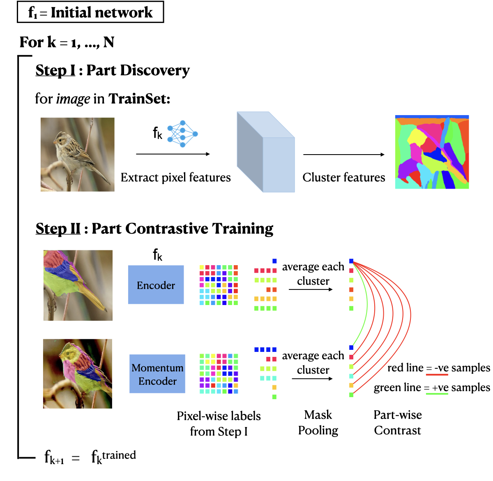

# PARTICLE

This is the code for the training and evaluation of part-contrast training proposed in

#### PARTICLE: Part Discovery and Contrastive Learning for Fine-grained Recognition

[Oindrila Saha](http://oindrilasaha.github.io), [Subhransu Maji](http://people.cs.umass.edu/~smaji/) 



## Preparation

Create a conda environment with the specifications
```
conda create --name <env name> --file spec-file.txt
conda activate <env name>
```
-> Make a folder named data_dir here

-> Download PASCUB dataset from [here](https://drive.google.com/drive/folders/1zCOlttyhv1z9AALGTBtBVXYLtBO3-clQ?usp=sharing) in data_dir

-> Download the full CUB dataset (images and segmentations) from [here](https://www.vision.caltech.edu/datasets/cub_200_2011/) to data_dir
and extract images into single folder by:

```
cd <path to cub data>/images/ 
for folder in *; do; mv $folder/* ../images_extracted/.; done
```

-> Download OID dataset from [here](https://www.robots.ox.ac.uk/~vgg/data/oid/) in data_dir

-> Download pretained checkpoints from [here](https://drive.google.com/drive/folders/1EqAiUKdKc_jF-DaTWyCWHh7h6KNEU7UJ?usp=sharing) into pretrained_models folder inside ssl_training folder


## PARTICLE Training
```
cd ssl_training
```

### ResNeT Variation - DetCon init

First generate clusters using:

```
python generate_clusters_resnet.py --dataset <dataset type - “birds” or “aircrafts”> --save_dir <dir to save part cluster masks>
```

Next train ResNet PARTICLE:
```
python train_particle_resnet.py --dataset <dataset type - “birds” or “aircrafts”> --seg_dir <dir of masks generated in previous step> --save_path <path to save models>
```

### ViT Variation - DINO init

First generate clusters using:
```
python generate_clusters_vit.py --dataset <dataset type - “birds” or “aircrafts”> --save_dir <dir to save part cluster masks>
```

Next train ViT PARTICLE
```
python -m torch.distributed.launch --nproc_per_node=8 train_particle_vit.py --dataset <dataset type - “birds” or “aircrafts”> --seg_dir <dir of masks generated in previous step> —output_dir <path to save models>
```

## PARTICLE Evaluation

### Linear Evaluation
Test on classifcation using the checkpoints obtained by training PARTICLE:
```
python test_linear.py --arch <architecture - “resnet50” or "vit_small"> --dataset <dataset type - “birds” or “aircrafts”> --pretrained_weights <trained particle checkpoint>
```

### Few-Shot Part Segmentation

Train on segmentation downstream task using the checkpoints obtained by training PARTICLE:
```
python train_fcn.py —-arch <architecture - “res50” or “dino”> —-dataset <dataset type - “birds” or “aircrafts”> —-ckpt <trained particle checkpoint> —-save_path <path to save fcn set models”
```

Find cross-validation mIoU using:
```
python test_miou.py —-arch <architecture - “res50” or “dino”> —-dataset <dataset type - “birds” or “aircrafts”> —-ckpt_dir <folder of seg ckpts from previous step >
```


